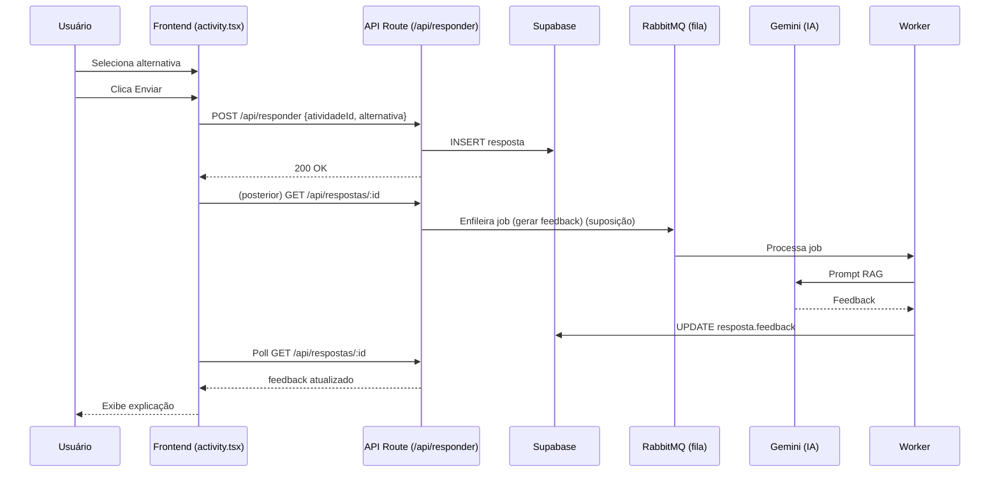

# 🏛 Arquitetura

Esta seção descreve como o projeto está organizado internamente.

## 🗂 Árvore de Diretórios (Resumo)

(Exibindo apenas partes principais mencionadas)

```text
src/
  app/
    home/page.tsx
    estruturas/
      lista/
        types/
          ldse/
            activity.tsx
            rag_contexts.ts
    api/                # (supondo rotas REST - não encontrado no snapshot)
  components/
    sidebar/
    ui/
  contexts/             # (suposição: estado global - não exibido)
  lib/
  test/                 # config de testes (suposição)
workers/                # processamento fila (suposição)
docs/
README.md
```

Itens marcados como suposição não apareceram no trecho fornecido, mas são coerentes com o padrão do ecossistema Next.js e variáveis.

## 🧱 Camadas (Lógicas)

| Camada                 | Papel                               | Exemplos                          |
| ---------------------- | ----------------------------------- | --------------------------------- |
| Interface (UI)         | Componentes React e páginas         | /src/app/home/page.tsx            |
| Módulos Educacionais   | Lógica específica de cada estrutura | /src/app/estruturas/lista/...     |
| Serviços / Utilitários | Regras de negócio, helpers          | /src/lib/\* (não listado)         |
| API Routes             | Endpoints REST (App Router)         | /src/app/api/\*                   |
| Integração IA          | Geração de feedback                 | rag_contexts.ts + chamadas Gemini |
| Persistência           | Banco Supabase                      | Acessos via libs (não mostradas)  |
| Filas                  | Processamento assíncrono            | RabbitMQ + /workers               |
| Autenticação           | Sessões de usuário                  | NextAuth                          |

## 🔌 Pontos de Entrada

- Web: App Router do Next.js (cada diretório com page.tsx).
- Página inicial pós-login: /src/app/home/page.tsx.
- Atividades: /src/app/estruturas/lista/types/ldse/activity.tsx.

## 🚦 Rotas / Endpoints

Formato padrão Next.js App Router:

```
/src/app/api/<nome>/route.ts
```

No snapshot não foram mostrados, mas o front chama:

- GET /api/atividades
- POST /api/responder
- GET /api/respostas/:id

Esses devem existir em pastas respectivas:

```
src/app/api/atividades/route.ts
src/app/api/responder/route.ts
src/app/api/respostas/[id]/route.ts
```

Se não existirem, criar (ver docs/how-to-add-a-module.md para template).

## 🧠 Estado Global

Trecho em /src/app/home/page.tsx:

```ts
const { progress, dataStructures } = useAppContext();
```

Logo existe um contexto em /src/contexts/AppContext.(tsx|ts). Não exibido → “não encontrado”.

Armazena progresso (datas de último acesso) e catálogo de estruturas.

## 📄 Exemplo de Análise IA

Arquivo: /src/app/estruturas/lista/types/ldse/rag_contexts.ts monta prompt contextualizado com:

- objetivo
- requisitos
- critérios de avaliação

## 🔄 Fluxo Request → Response (Exemplo Submissão de Resposta)



## 🧾 Variáveis de Ambiente (Consolidadas)

| Variável                         | Uso                    | Observação                |
| -------------------------------- | ---------------------- | ------------------------- |
| GOOGLE_CLIENT_ID / SECRET        | OAuth Google           | Cadastro no Google Cloud  |
| NEXTAUTH_SECRET                  | Criptografia de sessão | Gerar via OpenSSL         |
| NEXTAUTH_URL                     | URL base               | http://localhost:3000 dev |
| SUPABASE_URL                     | Acesso DB              | Projeto Supabase          |
| SUPABASE_SERVICE_ROLE_KEY        | Chave privilegiada     | Manter privada            |
| GEMINI_API_KEY / GEMINI_API_KEY2 | IA (Gemini)            | Chave e reserva           |
| RABBITMQ_URL                     | Filas                  | Docker local ou CloudAMQP |

## 🗄 Banco de Dados (Suposição)

Provável tabelas (não encontradas):

- usuarios
- atividades
- respostas
- logs_ia
  Adicionar migrations estruturadas (ver tutorial de módulo para exemplo).

## 🤖 Filas

- Worker (suposição em /workers) consome mensagens para:
  - Gerar feedback IA
  - Registrar logs
  - Enviar emails (possível extensão)

## 🔐 Autenticação

- Implementada com NextAuth (Google Provider).
- Sessão obtida em componentes via useSession() (ex: activity.tsx).

## 🧪 Testes

- Vitest (scripts listados em README).
- Diretórios de testes: **tests**/ (unitários) + possível config em /src/test.

## 🎨 UI / Componentes

- shadcn/ui em /src/components/ui.
- Ícones lucide-react.
- Estilização: Tailwind (arquivo global em /src/app/globals.css – não listado, suposição).

## 📝 Logs

Função registrarLogIA em /src/lib/logIAHelper (arquivo não visto → suposição).
Chamado em activity.tsx para trilha de eventos: enviar_resposta, solicitar_explicacao, receber_explicacao, timeout_explicacao.

## 🧩 Extensibilidade

Novo módulo segue padrão:

```
src/app/estruturas/<nome>/page.tsx
src/app/estruturas/<nome>/types/<variação>/*
```

Ver docs/how-to-add-a-module.md para passo a passo.

## 🛡 Boas Práticas Recomendadas

- Segregar prompts IA em arquivos dedicados (já feito).
- Adicionar tipagem forte para respostas de API (DTOs).
- Implementar caching para listas de atividades.
- Centralizar fetch em hooks ou services.

## 🚨 Erros Comuns

| Sintoma                     | Causa                             | Solução                 |
| --------------------------- | --------------------------------- | ----------------------- |
| 401 após login              | NEXTAUTH_SECRET incorreta         | Regenerar e reiniciar   |
| Falha fetch /api/atividades | Rota não criada                   | Criar route.ts          |
| Feedback não aparece        | Worker não rodando / fila ausente | Subir RabbitMQ e worker |
| Variáveis undefined         | .env faltando                     | Ver docs/setup.md       |

## 🧭 Próximo

Criar um módulo novo? Vá para docs/how-to-add-a-module.md.
